# SyncNode Hardware Wiring Diagram

This document details the exact physical electrical connections between the **ESP32 development board (WROVER kit target)** and the peripheral hardware modules (DAC, OLED, buttons, and potentiometer) used in the **SyncNode** audio player.

---

## 🔌 Connection Map Overview

```mermaid
graph TD
    subgraph ESP32 WROVER Board
        GND[GND]
        3V3[3.3V]
        5V[5V / VIN]
        G22[GPIO 22 - Data]
        G25[GPIO 25 - WS]
        G26[GPIO 26 - BCK]
        G21[GPIO 21 - SDA]
        G19[GPIO 19 - SCL]
        G32[GPIO 32 - Button Play]
        G33[GPIO 33 - Button Next]
        G27[GPIO 27 - Button Prev]
        G36[GPIO 36 - Pot Wiper]
    end

    subgraph PCM5102A I2S DAC
        D_VIN[vin]
        D_GND[gnd]
        D_BCK[bck]
        D_DIN[din]
        D_LCK[lck]
        D_SCK[sck]
        D_L[L-OUT]
        D_R[R-OUT]
        D_AGND[GND-OUT]
    end

    subgraph SSD1306 OLED Display
        O_VDD[vdd]
        O_GND[gnd]
        O_SDA[sda]
        O_SCK[sck]
    end

    subgraph User Inputs
        P_POT[B10K Potentiometer]
        B_PLAY[Play/Pause Button]
        B_NEXT[Next Button]
        B_PREV[Prev Button]
    end

    subgraph Audio Jack 3.5mm
        J_L[Left Channel]
        J_R[Right Channel]
        J_GND[Ground]
    end

    %% Power distribution
    5V --> D_VIN
    3V3 --> O_VDD
    3V3 --> P_POT
    GND --> D_GND
    GND --> O_GND
    GND --> B_PLAY
    GND --> B_NEXT
    GND --> B_PREV

    %% I2S DAC
    G26 --> D_BCK
    G25 --> D_LCK
    G22 --> D_DIN
    D_GND --- D_SCK

    %% I2C OLED
    G21 --> O_SDA
    G19 --> O_SCK

    %% Controls
    G32 --> B_PLAY
    G33 --> B_NEXT
    G27 --> B_PREV
    G36 --> P_POT

    %% Audio Outputs
    D_L --> J_L
    D_R --> J_R
    D_AGND --> J_GND
```

---

## 🛠️ Step-by-Step Pin Mappings

### 1. PCM5102A I2S DAC (Audio Output)
The PCM5102A takes digital audio from the ESP32 and converts it to high-fidelity analog audio. 

| Board Pin (Labeled) | ESP32 Pin | Wire Color (Rec.) | Description |
| :--- | :--- | :--- | :--- |
| **vin** | **5V / VIN** | Red | Main power supply (5V or 3.3V compatible) |
| **gnd** | **GND** | Black | Digital Ground |
| **bck** | **GPIO 26** | Yellow | Bit Clock (BCLK) |
| **din** | **GPIO 22** | Orange | Data In (I2S DOUT) |
| **lck** | **GPIO 25** | Green | Left/Right Word Select (WS / LRCLK) |
| **sck** | **GND** | Black | System Clock (Must connect to GND to enable internal PLL) |

> [!WARNING]
> **sck Jumper Configuration:** The PCM5102A module requires a system clock. The ESP32 does not output an SCK master clock by default. You **must** connect the **sck pin to GND** (on the module or ESP32). This triggers the PCM5102A to generate its own clock internally from the bck line.

---

### 2. SSD1306 OLED Display (128x64 I2C Visualizer)
Provides real-time feedback on connection status, Wi-Fi strength, track titles, and active volume.

| Board Pin (Labeled) | ESP32 Pin | Wire Color (Rec.) | Description |
| :--- | :--- | :--- | :--- |
| **vdd** | **3V3** | Red | Power supply (3.3V maximum) |
| **gnd** | **GND** | Black | System Ground |
| **sda** | **GPIO 21** | Blue | Serial Data Line |
| **sck** | **GPIO 19** | White | Serial Clock Line |

---

### 3. Volume Potentiometer (B10K Linear Dial)
Adjusts local volume on the ESP32, which immediately recalibrates the DAC and syncs back to the dashboard.

*   **Pin 1 (Left Leg):** Connect to **GND** (Black wire)
*   **Pin 2 (Center Wiper):** Connect to **GPIO 36 (VP Pin)** (Gray wire)
*   **Pin 3 (Right Leg):** Connect to **3V3** (Red wire)

> [!CAUTION]
> **Voltage Limit:** Never connect the potentiometer's power leg to 5V. The ESP32 analog-to-digital converter (ADC) has a maximum input ceiling of 3.3V. Connecting it to 5V will damage the ADC pin.

---

### 4. Push Buttons (Control Buttons)
Used for tactile control. In the firmware, internal pull-up resistors are enabled, meaning pressing the buttons pulls the pins to Ground (Active Low).

| Button | ESP32 Pin | Secondary Connection | Pin Configuration |
| :--- | :--- | :--- | :--- |
| **Play / Pause** | **GPIO 32** | GND | Internal Pull-Up, active LOW |
| **Skip Next** | **GPIO 33** | GND | Internal Pull-Up, active LOW |
| **Previous** | **GPIO 27** | GND | Internal Pull-Up, active LOW |

---

### 5. 3.5mm AUX Audio Output Jack
Extracts analog sound from the DAC for headphones or amplifiers.

| AUX Jack Terminal | PCM5102A Board Pin | Description |
| :--- | :--- | :--- |
| **Tip** | **L-OUT** | Left Audio Channel |
| **Ring** | **R-OUT** | Right Audio Channel |
| **Sleeve** | **GND-OUT** | Analog Audio Ground |
